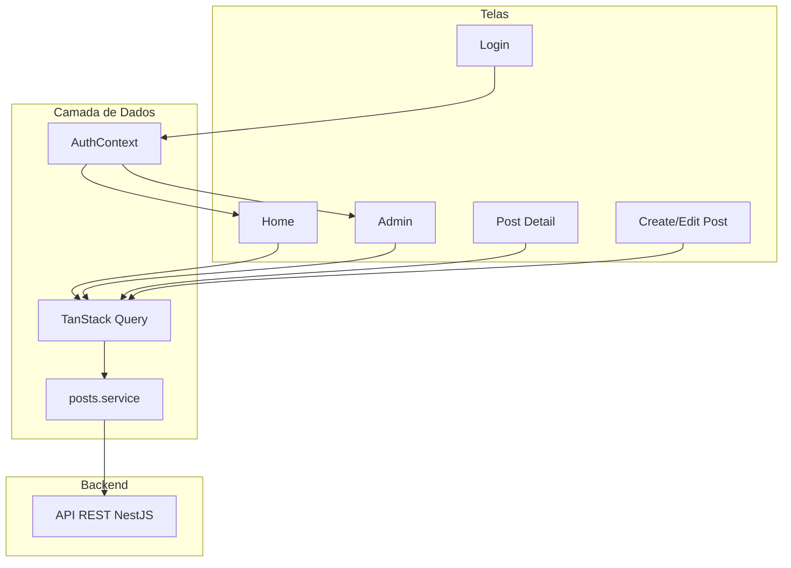

# Blog Mobile FIAP

Aplicativo mobile de blog desenvolvido com React Native e Expo, integrado à API REST do backend NestJS. Permite listagem, leitura, criação, edição e exclusão de postagens, com autenticação mock que diferencia perfis de professor e aluno.

---

## Índice

- [Setup inicial](#setup-inicial)
- [Pré-requisitos](#pré-requisitos)
- [Arquitetura da aplicação](#arquitetura-da-aplicação)
- [Guia de uso](#guia-de-uso)
- [Configuração da URL da API](#configuração-da-url-da-api)

---

## Setup inicial

### 1. Clone o repositório

```bash
git clone <url-do-repositorio>
cd blog-mobile-fiap
```

### 2. Instale as dependências

```bash
npm install
```

### 3. Configure a API

Crie um arquivo `.env` na raiz do projeto (copie de `.env.example`):

```bash
cp .env.example .env
```

Edite o `.env` e defina a URL do backend:

```env
EXPO_PUBLIC_API_URL=http://<URL_DA_API>:3000
```

Exemplo para desenvolvimento local:

```env
EXPO_PUBLIC_API_URL=http://localhost:3000
```

**Importante:** O arquivo `.env` não deve ser commitado. As variáveis `EXPO_PUBLIC_*` são embutidas em tempo de build. Após alterar o `.env`, reinicie o Metro com `npx expo start --clear`.

---

## Pré-requisitos

- **Node.js** 18+ (recomendado 20+)
- **npm** ou **yarn**
- **Expo CLI** — não é necessário instalar globalmente; use `npx expo`
- **Emulador ou Expo Go:**
  - **Android:** Android Studio + emulador ou aplicativo Expo Go no dispositivo físico
  - **iOS:** Xcode + simulador (apenas macOS) ou aplicativo Expo Go
  - **Web:** navegador

---

## Arquitetura da aplicação

### Estrutura de pastas

```
src/
├── app/                      # Rotas (Expo Router)
│   ├── _layout.tsx           # Layout raiz, providers (Auth, Query)
│   ├── index.tsx             # Redireciona: login ou home
│   ├── (auth)/               # Grupo: login
│   │   ├── _layout.tsx
│   │   └── login.tsx
│   └── (authenticated)/      # Grupo: rotas autenticadas
│       ├── _layout.tsx       # Stack: home, admin, post, create, edit
│       ├── home.tsx          # Lista de posts + busca
│       ├── admin.tsx         # Painel admin (professor)
│       └── post/
│           ├── [id].tsx      # Leitura de post
│           ├── create-post.tsx
│           └── edit-post/[id].tsx
├── components/               # Componentes reutilizáveis
│   ├── admin/
│   ├── home/
│   └── post/
├── contexts/                 # AuthContext (mock)
├── hooks/                    # usePosts, usePost, useCreatePost, etc.
├── lib/                      # api.ts (Axios)
├── providers/                # QueryClientProvider
├── schemas/                  # Validação Zod (auth, post)
├── services/                 # posts.service.ts
├── types/                    # Tipos TypeScript
└── utils/                    # formatDate, truncateDescription
```

### Fluxo de dados



- **AuthContext:** Gerencia autenticação mock (professor/aluno) e persistência em AsyncStorage
- **TanStack Query:** Cache e gerenciamento de estado das requisições à API
- **posts.service:** Cliente Axios para os endpoints de posts

---

## Guia de uso

### Como rodar

```bash
npm install
# Configurar .env com EXPO_PUBLIC_API_URL
npx expo start
```

Após iniciar:

- **Dispositivo físico:** Escaneie o QR code com o aplicativo Expo Go
- **Android emulador:** Pressione `a` no terminal
- **iOS simulador:** Pressione `i` no terminal (apenas macOS)
- **Web:** Pressione `w` no terminal

### Fluxo de login

A autenticação é **mock** (simulada): qualquer email e senha são aceitos. O que define o perfil é a escolha do usuário:

1. Preencha email e senha (qualquer valor)
2. Use "Entrar como Professor" ou "Entrar como Aluno"
3. A sessão é persistida em AsyncStorage

### Navegação

- **Aluno:** Home (lista + busca) → toque no post → leitura
- **Professor:** Além das opções do aluno:
  - Botão "Novo post" no header da Home
  - Botão "Admin" no header → lista de posts com ações Editar e Excluir
  - Botão "Editar" na tela de leitura do post

---

## Configuração da URL da API

A URL da API é definida pela variável `EXPO_PUBLIC_API_URL` no arquivo `.env`. Use o valor adequado ao ambiente:

| Ambiente                            | URL                       | Observação                              |
| ----------------------------------- | ------------------------- | --------------------------------------- |
| **Web / iOS Simulator**             | `http://localhost:3000`   | localhost acessível                     |
| **Android Emulator**                | `http://10.0.2.2:3000`    | 10.0.2.2 representa o localhost do host |
| **Dispositivo físico (mesma rede)** | `http://192.168.x.x:3000` | Use o IP da sua máquina na rede local   |
| **Produção**                        | `https://sua-api.com`     | URL do backend em produção              |

**Importante:** Após alterar o `.env`, reinicie o Metro com `npx expo start --clear`, pois as variáveis `EXPO_PUBLIC_*` são embutidas em tempo de build.

---

## Scripts disponíveis

```bash
npm start          # Inicia o Expo (npx expo start)
npm run android    # Inicia no emulador Android
npm run ios        # Inicia no simulador iOS
npm run web        # Inicia no navegador
npm run lint       # Executa o linter
```

---

## Tecnologias

- **React Native** + **Expo**
- **Expo Router** (roteamento baseado em arquivos)
- **TanStack Query** (requisições e cache)
- **TanStack Form** + **Zod** (formulários e validação)
- **Context API** (gerenciamento de estados)
- **Axios** (cliente HTTP)
- **AsyncStorage** (persistência local)
